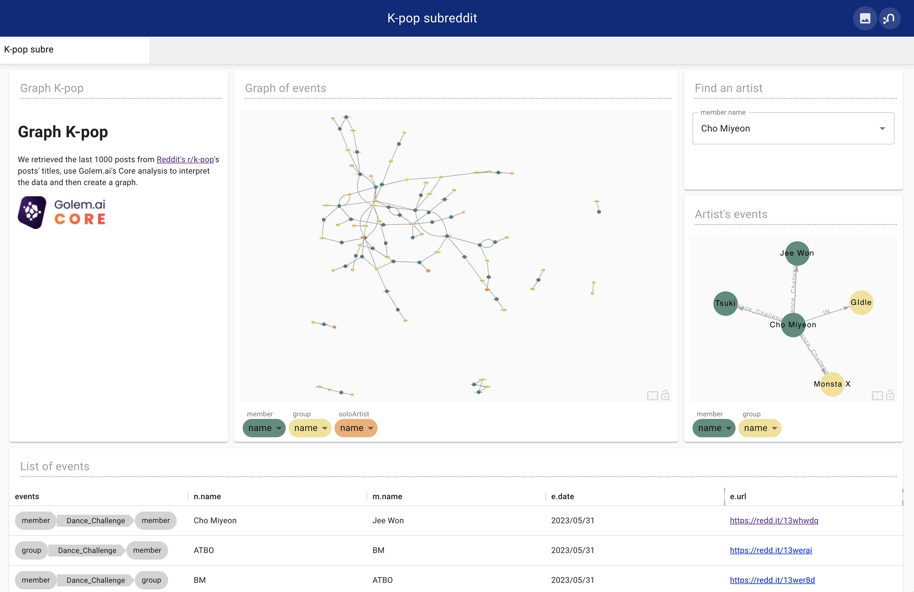
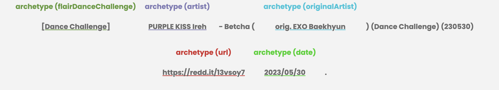
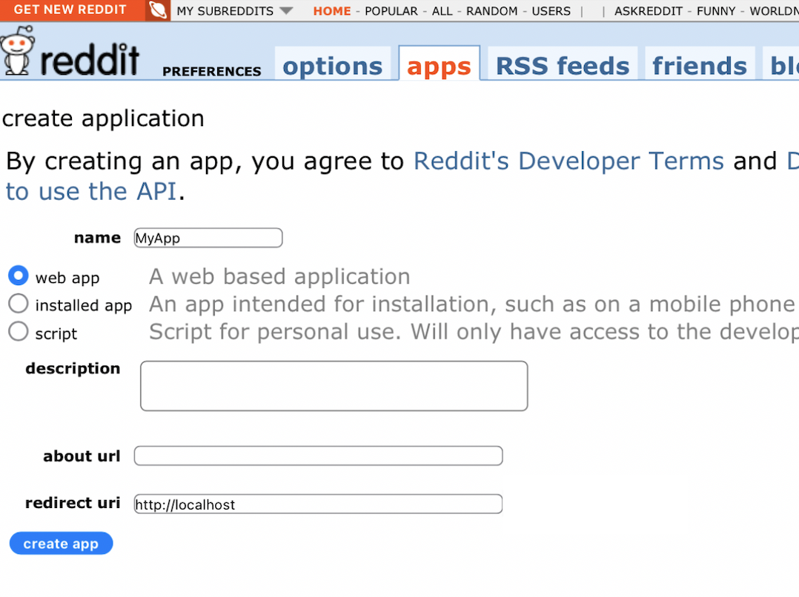
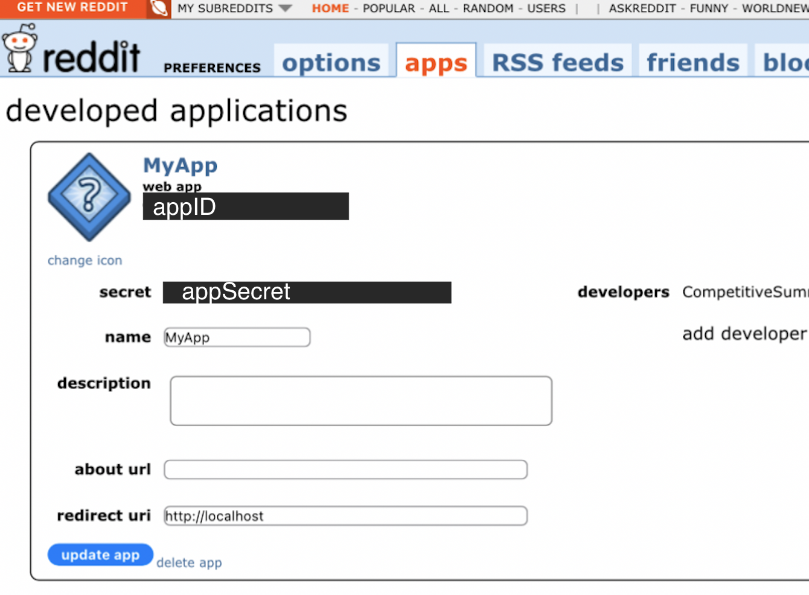

[](https://golem.ai/en/core)

# Graph K-pop

**Find the live showcase's dashboard [here](https://showcase.golem.ai/graph-kpop/neodash/) !** _You can connect by clicking on 'Connect'_



---
## Description 

This showcase gets data from [Reddit's K-pop subreddit](https://www.reddit.com/r/kpop/) and turns it into a graph.

To get the result shown above we used Reddit's API to get titles from [r/kpop](https://www.reddit.com/r/kpop/). 
```text
[Dance Challenge] PURPLE KISS Ireh - Betcha (orig. EXO Baekhyun) (Dance Challenge) (230530) https://redd.it/13vsoy7 2023/05/30.
```

We then sent this data to our AI to find interactions in the sentences.



We then used our AI's response to create nodes on the graph database [Neo4J](https://neo4j.com/).

And finally we used [NeoDash](https://neo4j.com/labs/neodash/) to create a visualisation of those data.

### Limitations

This showcase has a simple configuration with limited K-pop artists and groups. 

We could update it with new data sets for more precision. To do so this would take a query with the said data.


---
## Getting started

### Pre-Requisites

- [Docker](https://www.docker.com/)
- [Makefile](https://www.gnu.org/software/make/manual/make.html)
---

To have the stack running on your own machine you should run the following commands
```bash
make init
make up
```

This will start a Neo4J database, a NeoDash app, and a script which will read data from [kpopSubReddit.txt](./src/data/kpopSubReddit.txt) and push it to the graph database.

The following applications are now available:
- Neo4j: http://localhost:7474 _The graph database_
- NeoDash: http://localhost:5005/graph-kpop/neodash/ _The visualiser of the graph database_

You can run `make ps` to watch the state of your containers and `make logs` to check the script's state.

### Setting up Reddit IDs

Without Reddit IDs, the showcase will use a [pre-made dataset](./src/data/kpopSubReddit.txt).

To have freshly queried data you will need to set the following variables in your [.env](./src/.env)
```dotenv
REDDIT_CLIENT_ID=yourClientID
REDDIT_CLIENT_SECRET=yourClientSecret
```

To get a developer access to reddit you'll have to [create an app on their website](https://www.reddit.com/prefs/apps):





### Use a different file to create data

In the [config file](./src/config/config.py), you can set the variable `DATA_FILES` to the file you wish to use.

### NeoDash

To create your own cypher queries and dashboard you will have to set off the following environment variable of the `neodash` service in the [docker-compose.yml](./docker-compose.yml). 
```dotenv
standalone=off
```

The next time you start your container (`make up` or `docker-compose up -d neodash`) you should be able to click on New Dashboard or edit an existing one.

## Configure your own AI

Sign up for the [waiting list](https://golem.ai/fr/Core/waitinglist?utm_campaign=Waiting%20List%20Core&utm_source=Lien%20homepage&utm_medium=Lien%20homepage)